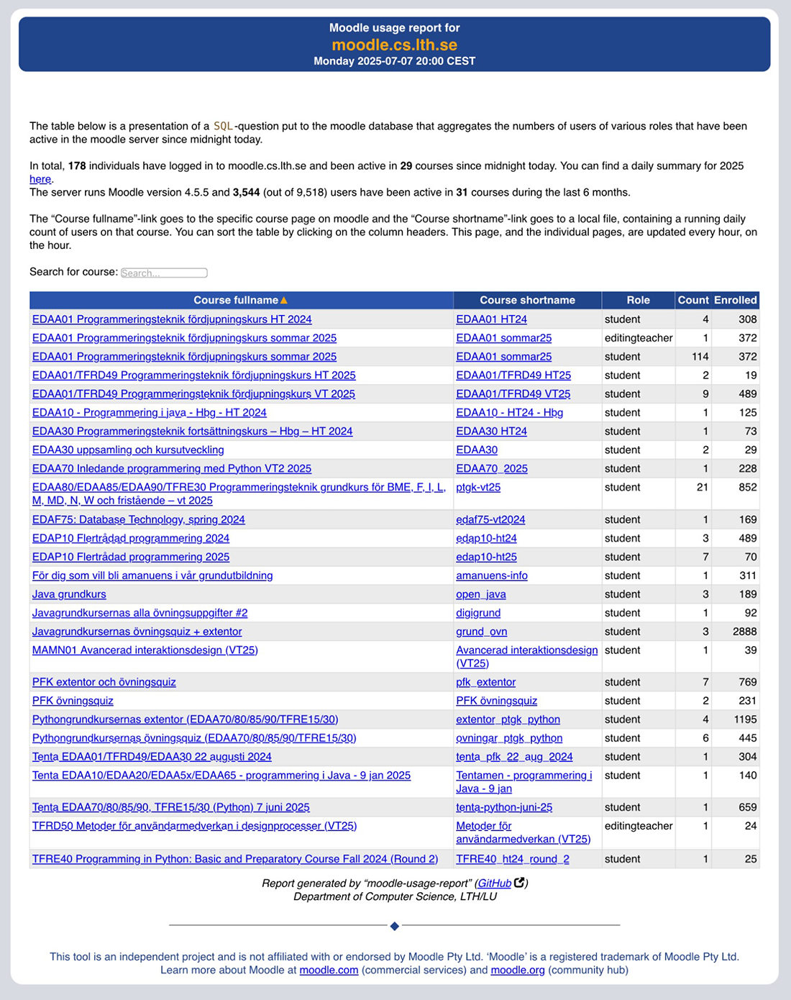

# moodle-usage-report

**moodle-usage-report** is a lightweight reporting tool designed to give teachers a clear, daily overview of user activity on a Moodle server. It extracts and summarizes log data using SQL and Bash, and publishes the results to a remote server in a human-readable format.

---

## 📄 License

This project is licensed under the 2-clause BSD License — see [LICENSE]or details.

---

## ✨ Features

- Tracks user activity per course and role
- Publishes daily reports with one line per day
- Supports Moodle servers running in Docker
- Minimal dependencies: just `bash` and `SQL`
- Easy to automate via `cron`
- Output can be integrated into dashboards or shared via web
- If a user want to hide one or more courses in the printout, write the course id (numerical value) into the settings variable `COURSE_ID_TO_HIDE` as a comma-separated list
- If local processing needs to be done on the material, an external script can be specified in the `LOCAL_PROCESSING` settings variable. (We use this to feed our departmental monitoring system with data from this script). This is done by using `source` and thus all variables in this script may be used by the extension
- Columns can be sorted by clicking the column headers
- Courses can be searched
- Maintains a textfile with the total number of users per day

---

## 📸 Example Output



---

## ⚙️  Requirements

- Bash (tested with Bash 5+)
- Access to Moodle's SQL database (tested with Moodle 4.5)
- SSH access to the report publishing server
- Moodle with logging enabled (`mdl_logstore_standard_log`)

---

## 📦 Deployment Notes

- Can be extended with local script (running as same user, so use it wisely).
- The report is written to a remote server via SSH and updated daily.
- Each report file contains one line per day, updated hourly.

---

## 🛠️ Installation

1. Clone the repository:

   ```bash
   git clone https://github.com/peter-moller/moodle-usage-report.git
   cd moodle-usage-report
   ```
2. Create a settings-file, `~/.moodle_usage_report.settings` containing the following items (customise to your local need):
   ```bash
   BLUE="#22458a"                                        # Dark blue color to use (not Moodles color!)
   ORANGE="#F9A510"                                      # Orange color to use (not Moodles color!)
   BOX_H_bgc=$BLUE                                       # Box header background color
   BOX_H_c=white                                         # Box header text color
   COURSE_ID_TO_HIDE="1034, 102"                         # Comma-separated list of courses to NOT present
   DB_COMMAND="docker exec moodledb /usr/bin/mariadb"    # Command to get into the database
   DB_USER=DB_username                                   # User account to get into the database
   DB_PASSWORD=SuperSecretPassword                       # Password
   JOBE_TH_BGC=$BLUE                                     # Table head background color
   JOBE_TH_C=white                                       # Table head text color
   JOBE_TH_SORTED_BGC=#2A55AC                            # Table head background color for sorting
   JOBE_TR_HOVERC=#bad8e1                                # Table row background color when mouse is hovering
   LOCAL_DIR=/var/tmp/moodle                             # Local directory to store the output from the script
   LOCAL_PROCESSING=                                     # Name of script to use for local processing of the table data
   REPORT_HEAD=https://fileadmin.cs.lth.se/intern/html/custom_report_head_sorting.html
   SERVER_NAME=moodle.example.dns                         # Name of the moodle-server that is being presented
   RSYNC_HOST=web-server.some.dns                        # DNS-name for the server that will publish the result
   RSYNC_DIR=/some/dir/moodle                            # Where on that server to put the files
   RSYNC_USER=remoteuser                                 # User name to use with rsync
   ```

3. Set up `cron` to run the project, i.e. `/etc/cron.d/moodle` (or something similar) with the following:
   ```bash
   0 * * * * root [ -x /path/to/moodle-usage-report/report.sh ] && /path/to/moodle-usage-report/report.sh >> /var/log/moodle-usage-report.log 2>&1
   ```
